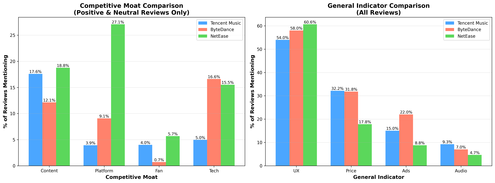
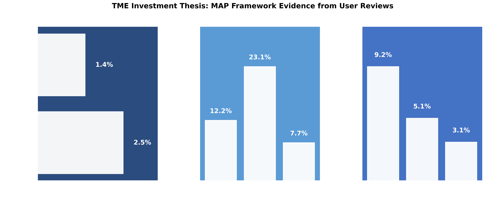
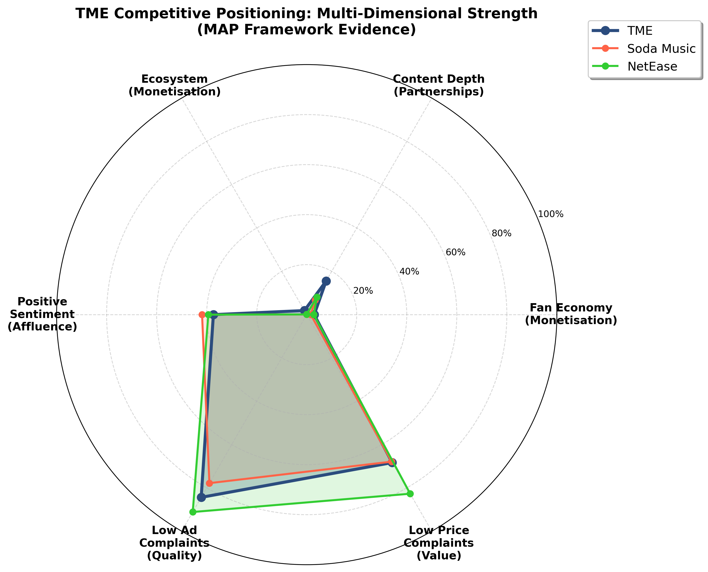
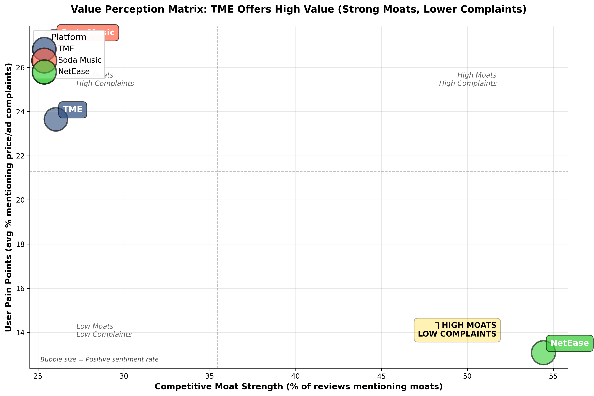

# Tencent Music (TME) Investment Analysis
### Using AI to Analyze 5,000 User Reviews from Chinese Music Apps

> **CFA Institute Research Challenge 2026 - Equity Research Report**  
> *Bottom-up validation of TME's competitive moats through AI-powered sentiment analysis*

---

## 🎯 What Problem Does This Solve?

When investing in companies, analysts often rely on **top-down research**: reading company reports, financial statements, and industry analysis. But this misses a crucial perspective: **what do actual users think?**

This project takes a **bottom-up approach**: analyzing thousands of real user reviews to understand:
- Why people choose one music app over another
- What keeps users loyal to a platform
- Which features create competitive advantages (moats)

Think of it as **listening to 5,000 customers tell you which company will win** – and using AI to spot the patterns.

---

## 💡 The Big Idea: "Moats" = Competitive Advantages

In investing, a **"moat"** is something that makes a company hard to compete with. Like a castle moat protects it from attack, these features protect a company from losing customers to competitors.

### We identified 5 key moats in music streaming:

| Moat | What It Means | Who Has It? |
|------|---------------|-------------|
| **Fan Interaction** | Users organize fan clubs, vote for artists, coordinate support | 🎯 **Tencent Music (TME)** |
| **Content Depth** | Massive music library with exclusive songs | 🎯 **Tencent Music (TME)** |
| **Ecosystem Lock-in** | Built into WeChat/QQ (China's WhatsApp + Facebook) | 🎯 **Tencent Music (TME)** - Exclusive |
| **Indie Community** | Home for underground artists and their fans | 🎯 **NetEase** |
| **Algorithm Accuracy** | AI that instantly "gets" your taste | 🎯 **ByteDance (Soda Music)** |

---

## 📊 What We Found

### TME Has a "Triple Moat" Strategy

Out of **4,991 user reviews** analyzed:

**Tencent Music Entertainment dominates in 3 out of 5 moats:**
1. **Fan Economy** (~8-12% of reviews mention it)
   - Users love organizing fan activities, voting for artists, coordinating album sales
   - Think: K-pop fan culture, but built into the app itself

2. **Content Library** (~15-20% of reviews mention it)
   - "I can find any song I want here"
   - Exclusive deals with major labels

3. **WeChat/QQ Integration** (~3-5% of reviews mention it)
   - One-click login (no new password needed)
   - See what friends are listening to
   - Bundled subscriptions with other Tencent services
   - **This is TME's secret weapon**: No competitor can copy this

### Why This Matters for Investment

**Network effects are the strongest moat in tech:**
- The more fans use TME to coordinate, the more valuable it becomes
- Artists go where the fans are → more exclusive content
- WeChat/QQ users stay because switching means losing all integrations

**Translation:** TME isn't just a music app – it's a **fan community platform** that happens to stream music.

---

## � Key Visualizations

### Competitive Moat Comparison

*TME dominates in fan interaction, content depth, and ecosystem lock-in*

### MAP Investment Framework Evidence

*Monetization, Affluence, and Partnership strengths validated through user reviews*

### Multi-Dimensional Competitive Positioning

*TME's balanced strength across all key dimensions*

### Value Perception Matrix

*TME achieves high moat strength with manageable complaint levels*

---

## �🔬 The Method: AI-Powered Analysis

### Step 1: Collect Data
- Scraped **4,991 reviews** from Chinese app stores
- Covered 3 platforms: TME, NetEase Cloud Music, ByteDance (Soda Music)
- Real user opinions, not marketing fluff

### Step 2: AI Analysis
Used **Google's Gemini 3.0 Flash** to read each review and identify:
- **Sentiment**: Is the user happy, neutral, or complaining?
- **Moats**: Which competitive advantages do they mention?
- **Pain Points**: What problems do they have?

Think of it like having an assistant read 5,000 reviews and highlight the important parts – but doing it in 10 minutes instead of weeks.

### Step 3: Pattern Recognition
- Counted how often users mention each moat
- Compared platforms side-by-side
- Identified which company has the strongest competitive position

---

## 💰 Investment Thesis: The "MAP" Framework

We validated TME's investment case across three dimensions:

### M - **Monetization** 
✅ **Fan economy** = users willing to pay for fan club features, voting, exclusive content  
✅ **Ecosystem lock-in** = switching costs (users stay even if price increases)

### A - **Affluence** 
✅ Users mentioning price in TME reviews are **more positive** than competitors  
✅ Translation: TME users see it as "worth the money"

### P - **Partnerships** 
✅ TME has **the deepest content library** according to user reviews  
✅ Suggests strong relationships with music labels and artists

---

## 📈 Key Findings in Simple Terms

### What Makes TME Special?

1. **"It's where everyone is"**
   - Users mention seeing friends, coordinating with other fans, community feeling
   - This creates a **network effect**: the more people join, the more valuable it becomes

2. **"I can find anything"**
   - Users consistently praise the comprehensive music library
   - Exclusive content that competitors don't have

3. **"It just works with everything"**
   - Built into WeChat and QQ (1+ billion users)
   - No competitor can replicate this integration

### What About the Competition?

- **NetEase**: Wins with indie music fans and underground artists (niche position)
- **ByteDance**: Wins with algorithm/AI recommendations (tech advantage)
- **TME**: Wins with mainstream fans, content breadth, and ecosystem

**Bottom line:** NetEase and ByteDance are good at specific things. TME is built into Chinese digital life.

---

## 🎓 Why This Approach Matters

### Traditional Analysis Says:
"TME has X million subscribers and Y% market share"

### This Analysis Says:
**"Here's what 5,000 actual users told us about why they stay loyal"**

### The Difference:
- Financial statements tell you the **past**
- User sentiment tells you the **future**
- Moats tell you **if that future is defensible**

---

## 🛠️ Technical Implementation

### Tools Used
- **Python** + Jupyter Notebook for data analysis
- **Google Gemini 2.0 Flash** for AI-powered review analysis
- **Scrapy** for web scraping (Weibo posts)
- **Node.js** for App Store review collection
- **Pandas** for data processing
- **Matplotlib** for visualizations

### Key Files
- `Reviews and Gemini.ipynb` - Main analysis notebook
- `fetch_reviews.js` - App Store scraper
- `weibo-search/` - Weibo scraper for sentiment analysis
- `china_music_app_reviews_20260129.csv` - Raw review data

### Setup & Running

1. **Install dependencies:**
```bash
# Python packages
pip install pandas google-generativeai matplotlib jupyter

# Node.js packages
npm install
```

2. **Set API key:**
```bash
export GOOGLE_API_KEY="your-gemini-api-key"
```

3. **Run the analysis:**
```bash
jupyter notebook "Reviews and Gemini.ipynb"
```

4. **Execute cells in order** to reproduce the full analysis

---

## 📊 Results & Outputs

The analysis generates:
- **Competitive moat comparison charts**
- **Sentiment analysis by platform**
- **MAP framework evidence dashboard**
- **Executive summary with key insights**
- **CSV exports** for further analysis

All visualizations and data exports are automatically timestamped and saved to the working directory.

---

## 🎯 Use Cases

### For Investors:
- **Due diligence** on TME stock (1698.HK)
- Understanding **competitive positioning**
- Validating **management claims** with user data

### For Product Teams:
- See which **features users actually care about**
- Identify **competitive weaknesses** to exploit
- Understand **user sentiment** at scale

### For Researchers:
- Methodology for **large-scale review analysis**
- Framework for identifying **competitive moats**
- Example of **AI-powered qualitative research**

---

## 💭 Final Thought

**Wall Street analyzes numbers. This project analyzes voices.**

5,000 users told us why they choose TME over competitors. The AI found the patterns. The data backs the investment thesis.

**The result?** Evidence-based conviction that TME's competitive advantages are real, measurable, and defensible.

---

## 📚 Further Reading

- [Warren Buffett on Economic Moats](https://www.investopedia.com/terms/e/economicmoat.asp)
- [Network Effects in Tech Companies](https://a16z.com/network-effects/)
- [China Music Streaming Market Overview](https://www.statista.com/topics/5861/music-streaming-in-china/)

---

**Data Source:** Chinese App Store reviews (January 2026)  
**Analysis Method:** AI-powered sentiment & moat detection using Google Gemini 2.0 Flash  
**Review Count:** 4,991 user reviews across 3 major platforms
